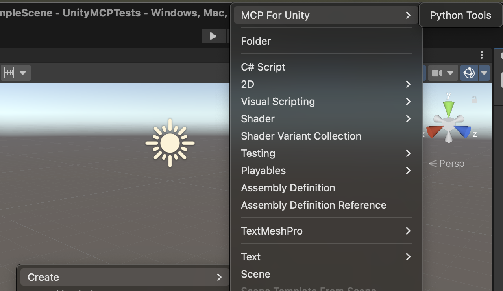
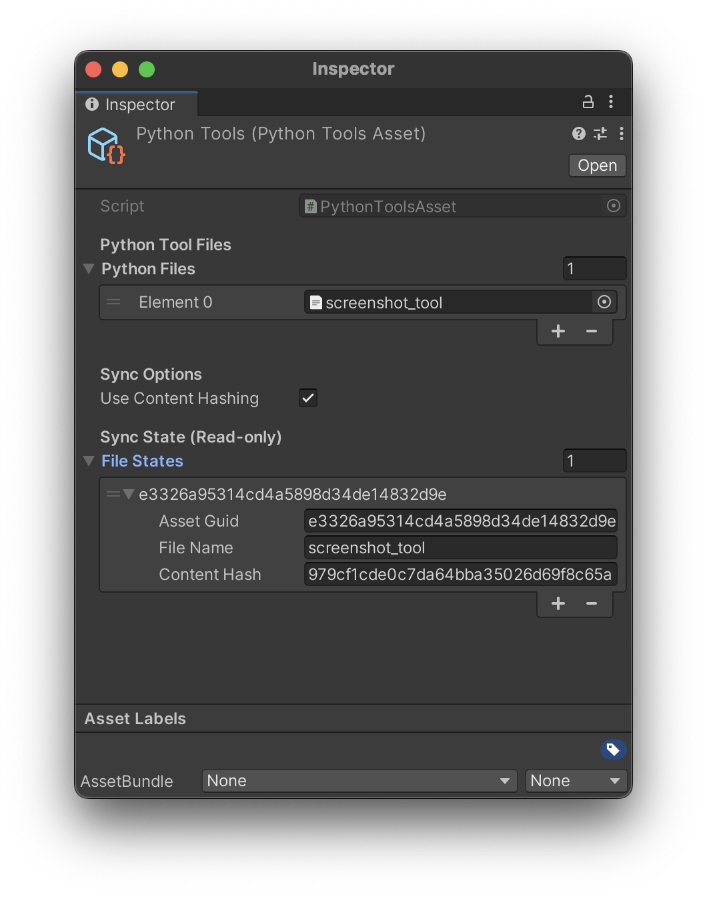

# Adding Custom Tools to MCP for Unity

MCP for Unity supports auto-discovery of custom tools using decorators (Python) and attributes (C#). This allows you to easily extend the MCP server with your own tools.

Be sure to review the developer README first:

| [English](README-DEV.md) | [简体中文](README-DEV-zh.md) |
|---------------------------|------------------------------|

---

# Part 1: How to Use (Quick Start Guide)

This section shows you how to add custom tools to your Unity project.

## Step 1: Create a PythonToolsAsset

First, create a ScriptableObject to manage your Python tools:

1. In Unity, right-click in the Project window
2. Select **Assets > Create > MCP For Unity > Python Tools**
3. Name it (e.g., `MyPythonTools`)



## Step 2: Create Your Python Tool File

Create a Python file **anywhere in your Unity project**. For example, `Assets/Editor/MyTools/my_custom_tool.py`:

```python
from typing import Annotated, Any
from mcp.server.fastmcp import Context
from registry import mcp_for_unity_tool
from unity_connection import send_command_with_retry

@mcp_for_unity_tool(
    description="My custom tool that does something amazing"
)
async def my_custom_tool(
    ctx: Context,
    param1: Annotated[str, "Description of param1"],
    param2: Annotated[int, "Description of param2"] | None = None
) -> dict[str, Any]:
    await ctx.info(f"Processing my_custom_tool: {param1}")

    # Prepare parameters for Unity
    params = {
        "action": "do_something",
        "param1": param1,
        "param2": param2,
    }
    params = {k: v for k, v in params.items() if v is not None}

    # Send to Unity handler
    response = send_command_with_retry("my_custom_tool", params)
    return response if isinstance(response, dict) else {"success": False, "message": str(response)}
```

## Step 3: Add Python File to Asset

1. Select your `PythonToolsAsset` in the Project window
2. In the Inspector, expand **Python Files**
3. Drag your `.py` file into the list (or click **+** and select it)



**Note:** If you can't see `.py` files in the object picker, go to **Window > MCP For Unity > Tool Sync > Reimport Python Files** to force Unity to recognize them as text assets.

## Step 4: Create C# Handler

Create a C# file anywhere in your Unity project (typically in `Editor/`):


```csharp
using Newtonsoft.Json.Linq;
using MCPForUnity.Editor.Helpers;

namespace MyProject.Editor.CustomTools
{
    [McpForUnityTool("my_custom_tool")]
    public static class MyCustomTool
    {
        public static object HandleCommand(JObject @params)
        {
            string action = @params["action"]?.ToString();
            string param1 = @params["param1"]?.ToString();
            int? param2 = @params["param2"]?.ToObject<int?>();

            // Your custom logic here
            if (string.IsNullOrEmpty(param1))
            {
                return Response.Error("param1 is required");
            }

            // Do something amazing
            DoSomethingAmazing(param1, param2);

            return Response.Success("Custom tool executed successfully!");
        }

        private static void DoSomethingAmazing(string param1, int? param2)
        {
            // Your implementation
        }
    }
}
```

## Step 5: Rebuild the MCP Server

1. Open the MCP for Unity window in the Unity Editor
2. Click **Rebuild Server** to apply your changes
3. Your tool is now available to MCP clients!

**What happens automatically:**
- ✅ Python files are synced to the MCP server on Unity startup
- ✅ Python files are synced when modified (you would need to rebuild the server)
- ✅ C# handlers are discovered via reflection
- ✅ Tools are registered with the MCP server

## Complete Example: Screenshot Tool

Here's a complete example showing how to create a screenshot capture tool.

### Python File (`Assets/Editor/ScreenShots/Python/screenshot_tool.py`)

```python
from typing import Annotated, Any

from mcp.server.fastmcp import Context

from registry import mcp_for_unity_tool
from unity_connection import send_command_with_retry


@mcp_for_unity_tool(
    description="Capture screenshots in Unity, saving them as PNGs"
)
async def capture_screenshot(
    ctx: Context,
    filename: Annotated[str, "Screenshot filename without extension, e.g., screenshot_01"],
) -> dict[str, Any]:
    await ctx.info(f"Capturing screenshot: {filename}")

    params = {
        "action": "capture",
        "filename": filename,
    }
    params = {k: v for k, v in params.items() if v is not None}

    response = send_command_with_retry("capture_screenshot", params)
    return response if isinstance(response, dict) else {"success": False, "message": str(response)}
```

### Add to PythonToolsAsset

1. Select your `PythonToolsAsset`
2. Add `screenshot_tool.py` to the **Python Files** list
3. The file will automatically sync to the MCP server

### C# Handler (`Assets/Editor/ScreenShots/CaptureScreenshotTool.cs`)

```csharp
using System.IO;
using Newtonsoft.Json.Linq;
using UnityEngine;
using MCPForUnity.Editor.Tools;

namespace MyProject.Editor.Tools
{
    [McpForUnityTool("capture_screenshot")]
    public static class CaptureScreenshotTool
    {
        public static object HandleCommand(JObject @params)
        {
            string filename = @params["filename"]?.ToString();

            if (string.IsNullOrEmpty(filename))
            {
                return MCPForUnity.Editor.Helpers.Response.Error("filename is required");
            }

            try
            {
                string absolutePath = Path.Combine(Application.dataPath, "Screenshots", filename);
                Directory.CreateDirectory(Path.GetDirectoryName(absolutePath));

                // Find the main camera
                Camera camera = Camera.main;
                if (camera == null)
                {
                    camera = Object.FindFirstObjectByType<Camera>();
                }

                if (camera == null)
                {
                    return MCPForUnity.Editor.Helpers.Response.Error("No camera found in the scene");
                }

                // Create a RenderTexture
                RenderTexture rt = new RenderTexture(Screen.width, Screen.height, 24);
                camera.targetTexture = rt;

                // Render the camera's view
                camera.Render();

                // Read pixels from the RenderTexture
                RenderTexture.active = rt;
                Texture2D screenshot = new Texture2D(Screen.width, Screen.height, TextureFormat.RGB24, false);
                screenshot.ReadPixels(new Rect(0, 0, Screen.width, Screen.height), 0, 0);
                screenshot.Apply();

                // Clean up
                camera.targetTexture = null;
                RenderTexture.active = null;
                Object.DestroyImmediate(rt);

                // Save to file
                byte[] bytes = screenshot.EncodeToPNG();
                File.WriteAllBytes(absolutePath, bytes);
                Object.DestroyImmediate(screenshot);

                return MCPForUnity.Editor.Helpers.Response.Success($"Screenshot saved to {absolutePath}", new
                {
                    path = absolutePath,
                });
            }
            catch (System.Exception ex)
            {
                return MCPForUnity.Editor.Helpers.Response.Error($"Failed to capture screenshot: {ex.Message}");
            }
        }
    }
}
```

### Rebuild and Test

1. Open the MCP for Unity window
2. Click **Rebuild Server**
3. Test your tool from your MCP client!

---

# Part 2: How It Works (Technical Details)

This section explains the technical implementation of the custom tools system.

## Python Side: Decorator System

### The `@mcp_for_unity_tool` Decorator

The decorator automatically registers your function as an MCP tool:

```python
@mcp_for_unity_tool(
    name="custom_name",          # Optional: function name used by default
    description="Tool description",  # Required: describe what the tool does
)
```

**How it works:**
- Auto-generates the tool name from the function name (e.g., `my_custom_tool`)
- Registers the tool with FastMCP during module import
- Supports all FastMCP `mcp.tool` decorator options: <https://gofastmcp.com/servers/tools#tools>

**Note:** All tools should have the `description` field. It's not strictly required, however, that parameter is the best place to define a description so that most MCP clients can read it. See [issue #289](https://github.com/CoplayDev/unity-mcp/issues/289).

### Auto-Discovery

Python tools are automatically discovered when:
- The Python file is added to a `PythonToolsAsset`
- The file is synced to `MCPForUnity/UnityMcpServer~/src/tools/custom/`
- The file is imported during server startup
- The decorator `@mcp_for_unity_tool` is used

### Sync System

The `PythonToolsAsset` system automatically syncs your Python files:

**When sync happens:**
- ✅ Unity starts up
- ✅ Python files are modified
- ✅ Python files are added/removed from the asset

**Manual controls:**
- **Sync Now:** Window > MCP For Unity > Tool Sync > Sync Python Tools
- **Toggle Auto-Sync:** Window > MCP For Unity > Tool Sync > Auto-Sync Python Tools
- **Reimport Python Files:** Window > MCP For Unity > Tool Sync > Reimport Python Files

**How it works:**
- Uses content hashing to detect changes (only syncs modified files)
- Files are copied to `MCPForUnity/UnityMcpServer~/src/tools/custom/`
- Stale files are automatically cleaned up

## C# Side: Attribute System

### The `[McpForUnityTool]` Attribute

The attribute marks your class as a tool handler:

```csharp
// Explicit command name
[McpForUnityTool("my_custom_tool")]
public static class MyCustomTool { }

// Auto-generated from class name (MyCustomTool → my_custom_tool)
[McpForUnityTool]
public static class MyCustomTool { }
```

### Auto-Discovery

C# handlers are automatically discovered when:
- The class has the `[McpForUnityTool]` attribute
- The class has a `public static HandleCommand(JObject)` method
- Unity loads the assembly containing the class

**How it works:**
- Unity scans all assemblies on startup
- Finds classes with `[McpForUnityTool]` attribute
- Registers them in the command registry
- Routes MCP commands to the appropriate handler

## Best Practices

### Python
- ✅ Use type hints with `Annotated` for parameter documentation
- ✅ Return `dict[str, Any]` with `{"success": bool, "message": str, "data": Any}`
- ✅ Use `ctx.info()` for logging
- ✅ Handle errors gracefully and return structured error responses
- ✅ Use `send_command_with_retry()` for Unity communication

### C#
- ✅ Use the `Response.Success()` and `Response.Error()` helper methods
- ✅ Validate input parameters before processing
- ✅ Use `@params["key"]?.ToObject<Type>()` for safe type conversion
- ✅ Return structured responses with meaningful data
- ✅ Handle exceptions and return error responses

## Debugging

### Python
- Check server logs: `~/Library/Application Support/UnityMCP/Logs/unity_mcp_server.log`
- Look for: `"Registered X MCP tools"` message on startup
- Use `ctx.info()` for debugging messages

### C#
- Check Unity Console for: `"MCP-FOR-UNITY: Auto-discovered X tools"` message
- Look for warnings about missing `HandleCommand` methods
- Use `Debug.Log()` in your handler for debugging

## Troubleshooting

**Tool not appearing:**
- **Python:** 
  - Ensure the `.py` file is added to a `PythonToolsAsset`
  - Check Unity Console for sync messages: "Python tools synced: X copied"
  - Verify file was synced to `UnityMcpServer~/src/tools/custom/`
  - Try manual sync: Window > MCP For Unity > Tool Sync > Sync Python Tools
  - Rebuild the server in the MCP for Unity window
- **C#:** 
  - Ensure the class has `[McpForUnityTool]` attribute
  - Ensure the class has a `public static HandleCommand(JObject)` method
  - Check Unity Console for: "MCP-FOR-UNITY: Auto-discovered X tools"

**Python files not showing in Inspector:**
- Go to **Window > MCP For Unity > Tool Sync > Reimport Python Files**
- This forces Unity to recognize `.py` files as TextAssets
- Check that `.py.meta` files show `ScriptedImporter` (not `DefaultImporter`)

**Sync not working:**
- Check if auto-sync is enabled: Window > MCP For Unity > Tool Sync > Auto-Sync Python Tools
- Look for errors in Unity Console
- Verify `PythonToolsAsset` has the correct files added

**Name conflicts:**
- Use explicit names in decorators/attributes to avoid conflicts
- Check registered tools: `CommandRegistry.GetAllCommandNames()` in C#

**Tool not being called:**
- Verify the command name matches between Python and C#
- Check that parameters are being passed correctly
- Look for errors in logs
