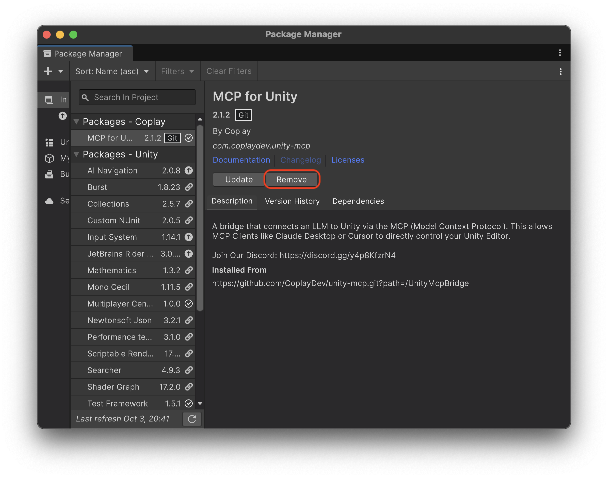
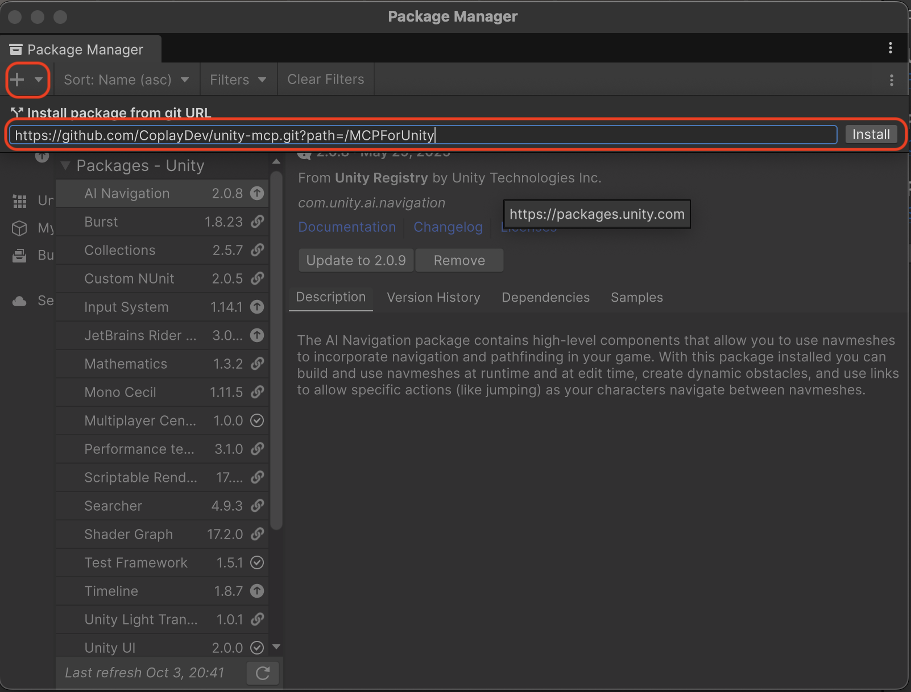
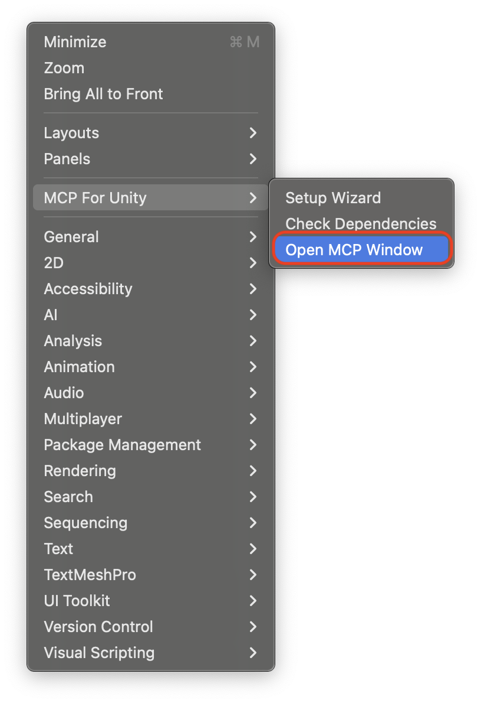
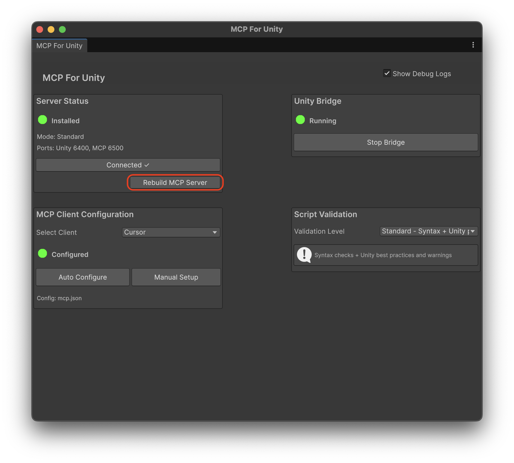

# MCP for Unity v5 Migration Guide

This guide will help you migrate from the legacy UnityMcpBridge installation to the new MCPForUnity package structure in version 5.

## Overview

Version 5 introduces a new package structure. The package is now installed from the `MCPForUnity` folder instead of the legacy `UnityMcpBridge` folder.

## Migration Steps

### Step 1: Uninstall the Current Package

1. Open the Unity Package Manager (**Window > Package Manager**)
2. Select **Packages: In Project** from the dropdown
3. Find **MCP for Unity** in the list
4. Click the **Remove** button to uninstall the legacy package

### Step 2: Install from the New Path

1. In the Package Manager, click the **+** button in the top-left corner
2. Select **Add package from git URL...**
3. Enter the following URL: `https://github.com/CoplayDev/unity-mcp.git?path=/MCPForUnity`
4. Click **Add** to install the package

### Step 3: Rebuild MCP Server

After installing the new package, you need to rebuild the MCP server:

1. In Unity, go to **Window > MCP for Unity > Open MCP Window**

2. Click the **Rebuild MCP Server** button

3. You should see a success message confirming the rebuild

## Verification

After completing these steps, verify the migration was successful:

- Check that the package appears in the Package Manager as **MCP for Unity**
- Confirm the package location shows the new `MCPForUnity` path
- Test basic MCP functionality to ensure everything works correctly

## Troubleshooting

- Check the Unity Console for specific error messages
- Ensure Python dependencies are properly installed
- Try pressing the rebuild button again
- Try restarting Unity and repeating the installation steps
