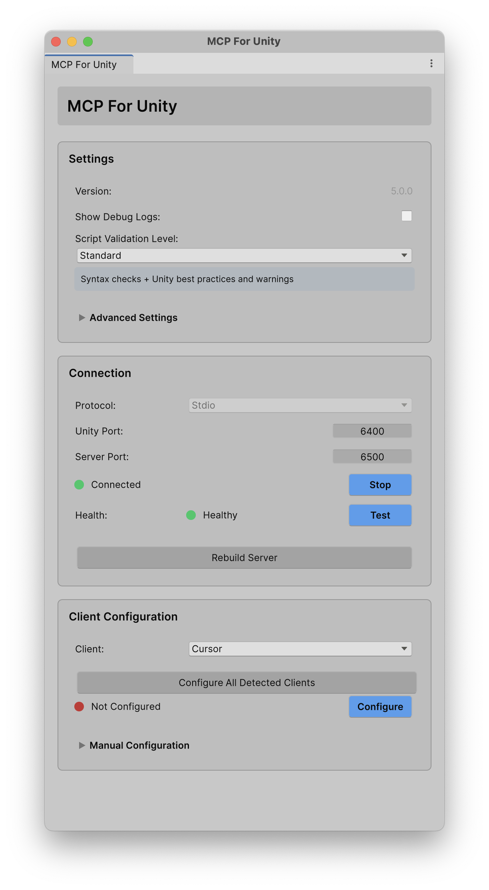
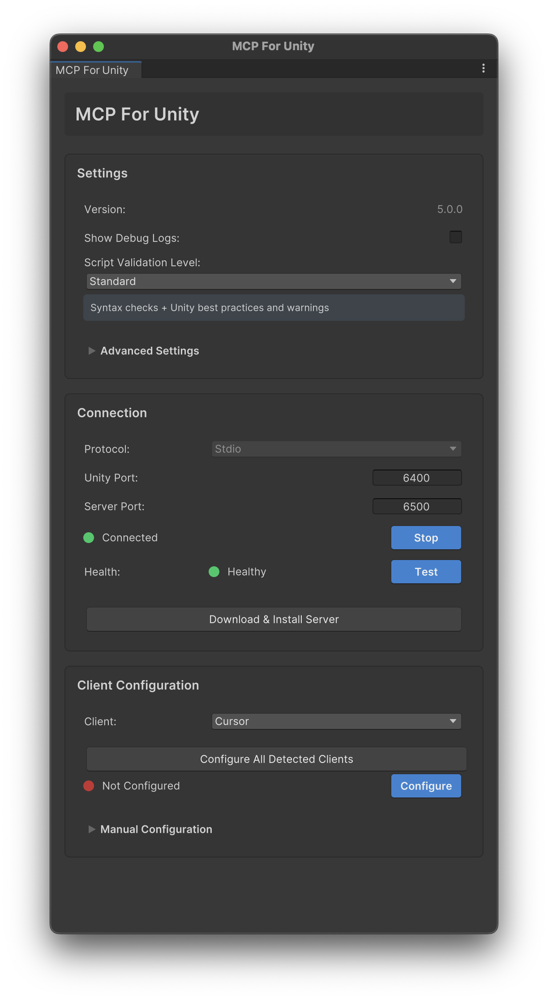

# MCP for Unity v6 - New Editor Window

> **UI Toolkit-based window with service-oriented architecture**


*Dark theme*


*Light theme*

---

## Overview

The new MCP Editor Window is a complete rebuild using **UI Toolkit (UXML/USS)** with a **service-oriented architecture**. The design philosophy emphasizes **explicit over implicit** behavior, making the system more predictable, testable, and maintainable.

**Quick Access:** `Cmd/Ctrl+Shift+M` or `Window > MCP For Unity > Open MCP Window`

**Key Improvements:**
- 🎨 Modern UI that doesn't hide info as the window size changes
- 🏗️ Service layer separates business logic from UI
- 🔧 Explicit path overrides for troubleshooting
- 📦 Asset Store support with server download capability
- ⚡ Keyboard shortcut for quick access

---

## Key Differences at a Glance

| Feature | Old Window | New Window | Notes |
|---------|-----------|------------|-------|
| **Architecture** | Monolithic | Service-based | Better testability & reusability |
| **UI Framework** | IMGUI | UI Toolkit (UXML/USS) | Modern, responsive, themeable |
| **Auto-Setup** | ✅ Automatic | ❌ Manual | Users have explicit control |
| **Path Overrides** | ⚠️ Python only | ✅ Python + UV + Claude CLI | Advanced troubleshooting |
| **Bridge Health** | ⚠️ Hidden | ✅ Visible with test button | Separate from connection status |
| **Configure All** | ❌ None | ✅ Batch with summary | Configure all clients at once |
| **Manual Config** | ✅ Popup windows | ✅ Inline foldout | Less window clutter |
| **Server Download** | ❌ None | ✅ Asset Store support | Download server from GitHub |
| **Keyboard Shortcut** | ❌ None | ✅ Cmd/Ctrl+Shift+M | Quick access |

## What's New

### UI Enhancements
- **Advanced Settings Foldout** - Collapsible section for path overrides (MCP server, UV, Claude CLI)
- **Visual Path Validation** - Green/red indicators show whether override paths are valid
- **Bridge Health Indicator** - Separate from connection status, shows handshake and ping/pong results
- **Manual Connection Test Button** - Verify bridge health on demand without reconnecting
- **Inline Manual Configuration** - Copy config path and JSON without opening separate windows

### Functional Improvements
- **Configure All Detected Clients** - One-click batch configuration with summary dialog
- **Keyboard Shortcut** - `Cmd/Ctrl+Shift+M` opens the window quickly

### Asset Store Support
- **Server Download Button** - Asset Store users can download the server from GitHub releases
- **Dynamic UI** - Shows appropriate button based on installation type


*Asset Store version showing the "Download & Install Server" button*

---

## Features Not Supported (By Design)

The new window intentionally removes implicit behaviors and complex edge-case handling to provide a cleaner, more predictable UX.

### ❌ Auto-Setup on First Run
- **Old:** Automatically configured clients on first window open
- **Why Removed:** Users should explicitly choose which clients to configure
- **Alternative:** Use "Configure All Detected Clients" button

### ❌ Python Detection Warning
- **Old:** Warning banner if Python not detected on system
- **Why Removed:** Setup Wizard handles dependency checks, we also can't flood a bunch of error and warning logs when submitting to the Asset Store
- **Alternative:** Run Setup Wizard via `Window > MCP For Unity > Setup Wizard`

### ❌ Separate Manual Setup Windows
- **Old:** `VSCodeManualSetupWindow`, `ManualConfigEditorWindow` popup dialogs
- **Why Removed:** Looks neater, less visual clutter
- **Alternative:** Inline "Manual Configuration" foldout with copy buttons

### ❌ Server Installation Status Panel
- **Old:** Dedicated panel showing server install status with color indicators
- **Why Removed:** Simplified to focus on active configuration and the connection status, we now have a setup wizard for this
- **Alternative:** Server path override in Advanced Settings + Rebuild button

---

## Service Locator Architecture

The new window uses a **service locator pattern** to access business logic without tight coupling. This provides flexibility for testing and future dependency injection migration.

### MCPServiceLocator

**Purpose:** Central access point for MCP services

**Usage:**
```csharp
// Access bridge service
MCPServiceLocator.Bridge.Start();

// Access client configuration service
MCPServiceLocator.Client.ConfigureAllDetectedClients();

// Access path resolver service
string mcpServerPath = MCPServiceLocator.Paths.GetMcpServerPath();
```

**Benefits:**
- No constructor dependencies (easy to use anywhere)
- Lazy initialization (services created only when needed)
- Testable (supports custom implementations via `Register()`)

---

### IBridgeControlService

**Purpose:** Manages MCP for Unity Bridge lifecycle and health verification

**Key Methods:**
- `Start()` / `Stop()` - Bridge lifecycle management
- `Verify(port)` - Health check with handshake + ping/pong validation
- `IsRunning` - Current bridge status
- `CurrentPort` - Active port number

**Implementation:** `BridgeControlService`

**Usage Example:**
```csharp
var bridge = MCPServiceLocator.Bridge;
bridge.Start();

var result = bridge.Verify(bridge.CurrentPort);
if (result.Success && result.PingSucceeded)
{
    Debug.Log("Bridge is healthy");
}
```

---

### IClientConfigurationService

**Purpose:** Handles MCP client configuration and registration

**Key Methods:**
- `ConfigureClient(client)` - Configure a single client
- `ConfigureAllDetectedClients()` - Batch configure with summary
- `CheckClientStatus(client)` - Verify client status + auto-rewrite paths
- `RegisterClaudeCode()` / `UnregisterClaudeCode()` - Claude Code management
- `GenerateConfigJson(client)` - Get JSON for manual configuration

**Implementation:** `ClientConfigurationService`

**Usage Example:**
```csharp
var clientService = MCPServiceLocator.Client;
var summary = clientService.ConfigureAllDetectedClients();
Debug.Log($"Configured: {summary.SuccessCount}, Failed: {summary.FailureCount}");
```

---

### IPathResolverService

**Purpose:** Resolves paths to required tools with override support

**Key Methods:**
- `GetMcpServerPath()` - MCP server directory
- `GetUvPath()` - UV executable path
- `GetClaudeCliPath()` - Claude CLI path
- `SetMcpServerOverride(path)` / `ClearMcpServerOverride()` - Manage MCP server overrides
- `SetUvPathOverride(path)` / `ClearUvPathOverride()` - Manage UV overrides
- `SetClaudeCliPathOverride(path)` / `ClearClaudeCliPathOverride()` - Manage Claude CLI overrides
- `IsPythonDetected()` / `IsUvDetected()` - Detection checks

**Implementation:** `PathResolverService`

**Usage Example:**
```csharp
var paths = MCPServiceLocator.Paths;

// Check if UV is detected
if (!paths.IsUvDetected())
{
    Debug.LogWarning("UV not found");
}

// Set an override
paths.SetUvPathOverride("/custom/path/to/uv");
```

## Technical Details

### Files Created

**Services:**
```text
MCPForUnity/Editor/Services/
├── IBridgeControlService.cs          # Bridge lifecycle interface
├── BridgeControlService.cs           # Bridge lifecycle implementation
├── IClientConfigurationService.cs    # Client config interface
├── ClientConfigurationService.cs     # Client config implementation
├── IPathResolverService.cs          # Path resolution interface
├── PathResolverService.cs           # Path resolution implementation
└── MCPServiceLocator.cs             # Service locator pattern
```

**Helpers:**
```text
MCPForUnity/Editor/Helpers/
└── AssetPathUtility.cs              # Package path detection & package.json parsing
```

**UI:**
```text
MCPForUnity/Editor/Windows/
├── MCPForUnityEditorWindowNew.cs    # Main window (~850 lines)
├── MCPForUnityEditorWindowNew.uxml  # UI Toolkit layout
└── MCPForUnityEditorWindowNew.uss   # UI Toolkit styles
```

**CI/CD:**
```text
.github/workflows/
└── bump-version.yml                 # Server upload to releases
```

### Key Files Modified

- `ServerInstaller.cs` - Added download/install logic for Asset Store
- `SetupWizard.cs` - Integration with new service locator
- `PackageDetector.cs` - Uses `AssetPathUtility` for version detection

---

## Migration Notes

### For Users

**Immediate Changes (v6.x):**
- Both old and new windows are available
- New window accessible via `Cmd/Ctrl+Shift+M` or menu
- Settings and overrides are shared between windows (same EditorPrefs keys)
- Services can be used by both windows

**Upcoming Changes (v8.x):**
- ⚠️ **Old window will be removed in v8.0**
- All users will automatically use the new window
- EditorPrefs keys remain the same (no migration needed)
- Custom scripts using old window APIs will need updates

### For Developers

**Using the Services:**
```csharp
// Accessing services from any editor script
var bridge = MCPServiceLocator.Bridge;
var client = MCPServiceLocator.Client;
var paths = MCPServiceLocator.Paths;

// Services are lazily initialized on first access
// No need to check for null
```

**Testing with Custom Implementations:**
```csharp
// In test setup
var mockBridge = new MockBridgeService();
MCPServiceLocator.Register(mockBridge);

// Services are now testable without Unity dependencies
```

**Reusing Service Logic:**
The service layer is designed to be reused by other parts of the codebase. For example:
- Build scripts can use `IClientConfigurationService` to auto-configure clients
- CI/CD can use `IBridgeControlService` to verify bridge health
- Tools can use `IPathResolverService` for consistent path resolution

**Notes:**
- A lot of Helpers will gradually be moved to the service layer
- Why not Dependency Injection? This change had a lot of changes, so we didn't want to add too much complexity to the codebase in one go

---

## Pull Request Reference

**PR #313:** [feat: New UI with service architecture](https://github.com/CoplayDev/unity-mcp/pull/313)

**Key Commits:**
- Service layer implementation
- UI Toolkit window rebuild
- Asset Store server download support
- CI/CD server upload automation

---

**Last Updated:** 2025-10-10  
**Unity Versions:** Unity 2021.3+ through Unity 6.x  
**Architecture:** Service Locator + UI Toolkit  
**Status:** Active (Old window deprecated in v8.0)
